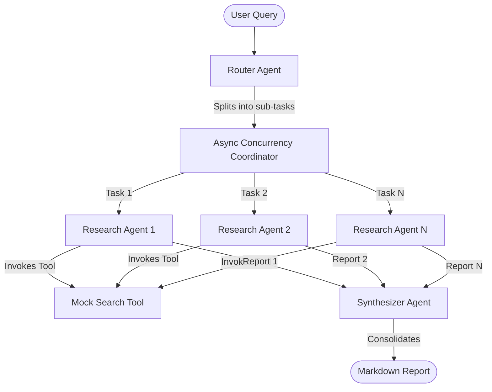

# Concurrent Multi-Agent Research Assistant

A highly modular, concurrent multi-agent research assistant built in Rust using the `rig-core` library and `tokio` async runtime. 

This project demonstrates how to orchestrate multiple LLM agents asynchronously using generic traits, configurable system prompts, and tool integrations (like search capability).

## Architecture

The system uses a 3-tier multi-agent pipeline:



1. **Router Agent**: Analyzes a complex prompt and decomposes it into independent sub-queries.
2. **Research Agents**: Multiple agents that execute in parallel (via `tokio::spawn` and async concurrency) to research each sub-query. They make use of a custom Rig search tool.
3. **Synthesizer Agent**: Aggregates all reports from the research agents and compiles a comprehensive, unified markdown report.

### Generic Provider Adapter

To avoid duplication and support multiple LLM providers seamlessly, the codebase abstracts all agent construction behind a custom `LlmAdapter` trait. This trait supports:
- **Gemini** (using `gemini-3.5-flash`)
- **OpenAI** (using `gpt-5.5-instant`)
- **Anthropic** (using `claude-4.6-sonnet`)
- **Ollama** (using local models like `llama3.2`)

---

## Getting Started

### Prerequisites
Ensure you have Rust and Cargo installed:
```bash
cargo --version
```

### Installation
Clone the repository and build:
```bash
git clone https://github.com/your-username/agentic-rust.git
cd agentic-rust
cargo build --release
```

---

## Configuration

### Environment Variables
Configure API keys for the cloud providers by setting them in your environment or creating a `.env` file in the root of the project:
```bash
# Copy example env template
cp .env.example .env
```
Inside `.env`:
```env
GEMINI_API_KEY=your_gemini_api_key_here
OPENAI_API_KEY=your_openai_api_key_here
ANTHROPIC_API_KEY=your_anthropic_api_key_here
```

### Configuration File (`config.toml`)
Default providers, models, and system prompts are fully configurable in `config.toml` so that you can adjust and fine-tune preambles without recompiling:
```toml
# Default LLM provider to use if --provider argument is omitted
default_provider = "gemini"

[models]
gemini = "gemini-3.5-flash"
openai = "gpt-5.5-instant"
anthropic = "claude-4.6-sonnet"
ollama = "llama3.2"

[prompts]
router_prompt = "You are a research coordinator..."
research_prompt = "You are an expert research analyst..."
synthesizer_prompt = "You are a professional editor..."
```

---

## Usage

Run the tool using `cargo run`.

### Command-Line Arguments
```bash
cargo run -- --provider gemini --query "Compare Rust and Go for CLI development"
```

### Options
* `-p`, `--provider <PROVIDER>`: Choose LLM provider (`gemini`, `openai`, `anthropic`, `ollama`).
* `-q`, `--query <QUERY>`: The research query to run.

### Interactive Mode
If arguments are omitted, the CLI will fall back to an interactive prompt guiding you to choose a provider and type a query.

---

## License

This project is dual-licensed under:
- **Apache License, Version 2.0** ([LICENSE-APACHE](LICENSE-APACHE) or http://www.apache.org/licenses/LICENSE-2.0)
- **MIT License** ([LICENSE-MIT](LICENSE-MIT) or http://opensource.org/licenses/MIT)
